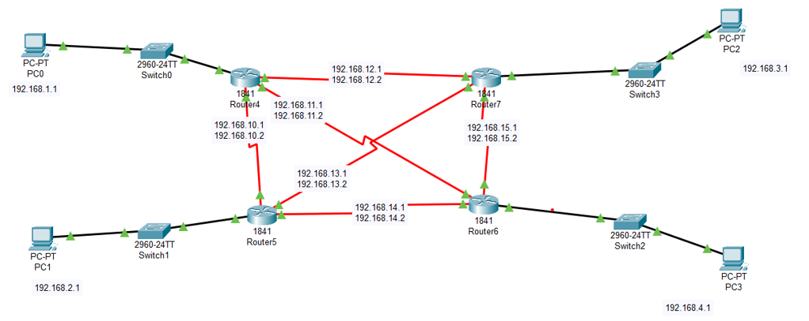
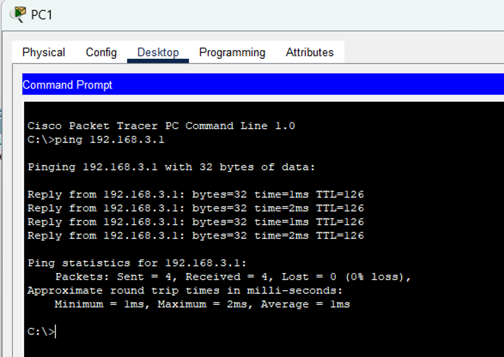
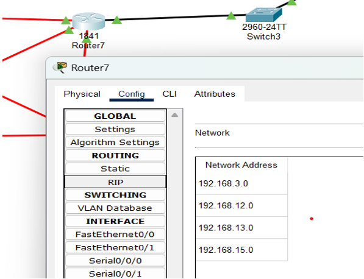

# RIP Routing & Subnet Communication Simulation 🚀

This project demonstrates a RIP-based routing setup in a multi-subnet environment using **Cisco Packet Tracer**. The network topology consists of multiple routers, switches and PCs configured across different subnets, where RIP is used to enable dynamic routing and inter-subnet communication.

> **Course:** Computer Networks (4th Semester)  
> **Tool Used:** Cisco Packet Tracer  
> **Focus:** Routing Information Protocol (RIP), subnetting, routing table behavior, and connectivity testing.

---

## 🔧 Tools & Technologies
- Cisco Packet Tracer
- RIP (Routing Information Protocol)
- IPv4 Addressing & Subnetting
- Traceroute, Ping, and Routing Table analysis

---

## 📂 Project Files
- `RIP-Routing-Simulation.pkt` – Main simulation file to be opened in Cisco Packet Tracer.
- `/assets/screenshots/` – Captures of topology, ping results, and routing outputs.

---

## 🧪 What’s Demonstrated

### ✅ Connectivity Tests
- Successful pings:
  - PC1 ➝ PC2
  - PC1 ➝ PC3
  - PC1 ➝ PC4

### 🗺️ Routing Table Output
- `rip route print` output on **Router 3**, showing dynamically learned routes.

### 🔎 Traceroute Results
- Packet journey from PC1 to PC3
- Packet journey from PC1 to PC4

---

## 📘 Key Learning
- How routers determine the destination subnet using the **network address and subnet mask**.
- The role of RIP in learning and distributing routes across a network.
- Verifying communication through **ICMP (Ping)** and **traceroute**.
- Understanding how routing tables direct traffic between subnets.

---

## 🧠 How Routing Decision Works (Short Answer)
A router determines whether a destination IP is in a particular subnet by performing a **bitwise AND operation** between the destination IP address and the subnet mask. If the result matches one of its known network addresses (based on its routing table), the router forwards the packet accordingly; otherwise, it looks for a default or next-best route.

---

## 📸 Screenshots
<p float="left">
  
  
  
</p>

*(More screenshots in the `assets/screenshots/` folder)*

---

## 📥 How to Run
1. Download or clone this repository:
   ```bash
   git clone https://github.com/Sameed-333/rip-routing-subnet-simulation.git
2. Open `RIP-Routing-Simulation.pkt` using **Cisco Packet Tracer**.
3. Use the terminal on PCs to:
  - ping other hosts to test connectivity
  - tracert to observe hop paths
4. Verify routing tables on routers, and traceroute results from PCs.

---

## ⚠️ Disclaimer
This simulation was created purely for educational purposes as part of a computer networking lab assignment.
